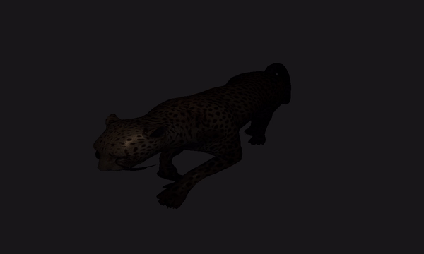

# DreamRealm
DreamRealm is a 3D Rendering Engine built with C++ and the Opengl graphics API with upcoming support for Vulkan

## Details:
DreamRealm is a 3D Rendering Engine built with C++ and the Opengl graphics API with upcoming support for Vulkan

### Features implemented so far are:
* Cmake support
* Environment Light (Point light, Directional light)
* Scene Camera
* Cloud simulation using perlin noise texture lookup on pixel shaders
* Distant Fog effect using linearized depth buffer technique
* [CrunchMath](https://github.com/harlexkhal/CrunchMath) support for graphics related calculations
* Mesh loading with support for animations with the [Open Asset Import Library (assimp)](https://github.com/assimp/assimp)
* Image/Texture loading with [STB image library](https://github.com/nothings/stb/blob/master/stb_image.h)
* [GLFW](https://github.com/glfw/glfw) support for windows creation, reading input, handling events

### Features to be implemented:
* Antialiancing
* Instancing
* Deferred Shading Technique
* Shadow mapping
* Bloom Effects
* HDR
* Rainbow light
* Text Rendering
* Level Editor
* Vulkan Support
* Voxel Rendering
* RayTracing

## More Detailed Roadmap of DreamRealm:
* [Project Todo's, Inprogress Backlogs ...'](https://github.com/users/harlexkhal/projects/3)

## Getting Started
These instructions will get you a copy of the project up and running on your local machine for development and testing purposes.

### Prerequisites
The basic requirements for building the executable are:

* CMake 3.8+
* C++ compiler

#### Cloning the project
```
git clone --recursive https://github.com/harlexkhal/DreamRealm <Your-Build-Directory>
```

### Building project with Cmake and building binaries
This program have been tested on Windows 10 and binaries built with visual studio 2019. but should work under any systems that fulfills the aforementioned requirements.

#### Building Project Solution Files
Make sure to set the environmental path variable of cmake. then on the parent directory of the project using cli. run

```
cmake .
```
On Visual studio. Build project, on the first build you would get an error of missing assimp static library. rebuild project and it would be fixed.
After a successful build from parent source directory go to ``` DreamRealm\Dependencies\Assimp\bin\Debug ``` and copy ``` assimp-vc142-mtd.dll ```
paste it into ``` DreamRealm\Debug ``` from parent directory. Now navigate to ``` Dependencies\GLFW\src\Debug ``` also from parent directory and copy ``` glfw3d.dll ``` then
paste it into ``` DreamRealm\Debug ``` from parent directory. now in your current directory which is ``` DreamRealm\Debug ``` you would see the binary ``` DreamRealm.exe ```. 
Now navigate to ``` DreamRealm ``` by going one directory backwards and copy the ``` src ``` folder and paste into ``` DreamRealm\Debug ```. and now you are done you can run
DreamRealm.exe from there or alternatively run it from the compiler.

Some screenshots along the way of developing:





## Built With
* [GLFW3](https://www.glfw.org/) - Used for display, reading inputs, and handling events
* [OpenGL](https://www.opengl.org/) - API used for communication with graphics drivers
* [CrunchMath](https://github.com/harlexkhal/CrunchMath) - Used for graphics related calculations
* [Open Asset Import Library (assimp)](http://assimp.org/) - Used for loading meshes
* [STB image](https://github.com/nothings/stb/blob/master/stb_image.h) - Used for loading images/textures 
## Author
* **Alexander Ibeh** - [harlexkhal](https://github.com/harlexkhal)